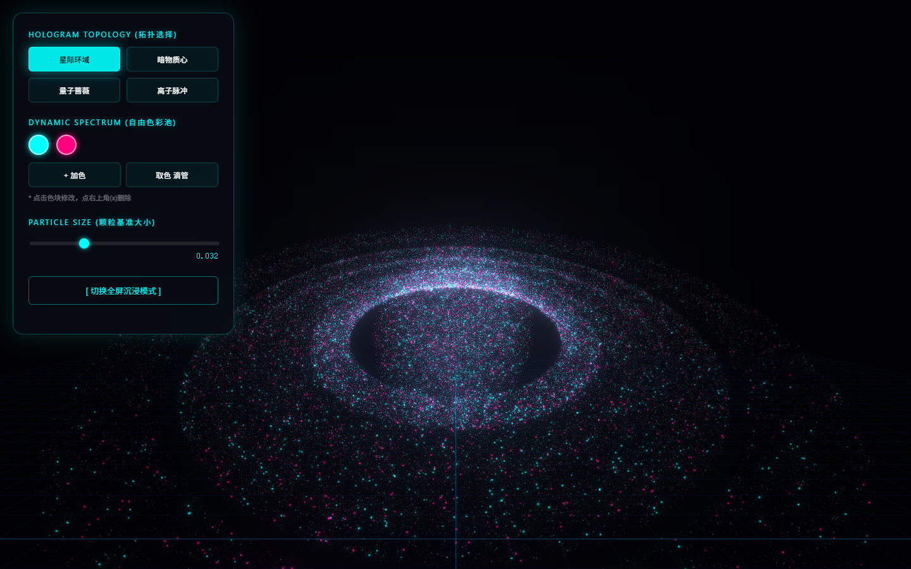
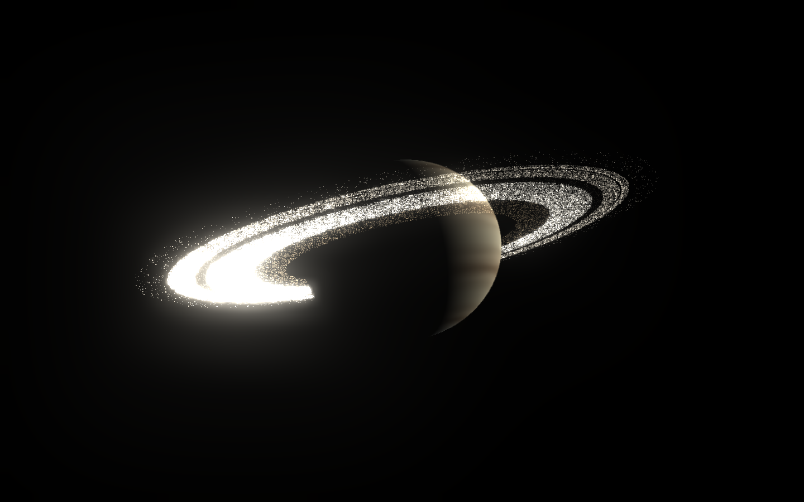

# 粒子交互

把摄像头的视觉输入变成可感知的空间交互 —— 两个纯前端实时渲染实验，无服务端、无构建步骤。

**[→ 在线演示](https://Noimpty-Q.github.io/particle-interaction/)** &nbsp;·&nbsp; 建议用桌面版 Chrome / Edge 打开

---

## 作品

| # | 作品 | 粒子规模 | 输入模态 | 技术 |
|---|------|---------|---------|------|
| 01 | [手势驱动 3D 粒子场](particles.html) | 75,000 | 手部 21 关键点 | Three.js r128 + UnrealBloom 后处理 |
| 02 | [程序化土星系统](saturn.html) | 150,000 | 无（自动运镜） | Three.js r160 · Instanced 绘制 · GLSL 程序化生成 |

### 01 手势驱动 3D 粒子场

前置摄像头捕捉手部 21 个关键点，映射为粒子场的引力中心与形态切换开关。
渲染管线走 `EffectComposer → RenderPass → UnrealBloomPass`，泛光阈值与强度可调。
内置四套拓扑形态（星云漩涡 / 暗物质心 / 量子蔷薇 / 离子脉冲）、可增删的自由色彩池、
以及从屏幕任意像素实时拾色回写粒子材质的吸管工具。上图为该作品的实际运行画面。

### 02 程序化土星系统

基于 Three.js r160 的 Instanced 渲染管线：以低多边形 Quad 为基础几何体，用
`InstancedBufferGeometry` + 三个 `InstancedBufferAttribute` 承载每个粒子的位置、
颜色与形变参数，**单次 draw call 提交 150,000 个粒子**。土星本体走 `SphereGeometry`
配自定义 `ShaderMaterial`；环带与粒子云的纹理细节全部由 GLSL 中的 `hash` / `noise`
函数程序化生成——**仓库内零贴图文件**，所有图案均由着色器实时计算。镜头沿预设轨迹自动运镜。



---

## 技术栈

```
识别层    MediaPipe Hands · Camera Utils                  （作品 01）
渲染层    Three.js r128（作品 01）· Three.js r160（作品 02）· GLSL
绘制      InstancedBufferGeometry · 单次 draw call 15 万粒子
后处理    EffectComposer · RenderPass · UnrealBloomPass · ShaderPass · FXAA
输入      Canvas 像素拾色 · 参数控制面板 · 自动运镜
```

依赖全部通过 CDN 加载（jsDelivr / cdnjs / unpkg），仓库内不含任何构建产物或第三方源码。

---

## 本地运行

**关键前提**：作品 01 需要调用 `getUserMedia` 访问摄像头，浏览器只在
**安全上下文**下开放该 API —— 即 `https://` 或 `localhost`。

直接双击 HTML 文件（`file://` 协议）**不会**拿到摄像头画面。必须起一个本地服务器：

```bash
# 进入项目目录后，任选一种

# Python 3（推荐，多数系统自带）
python -m http.server 8000

# 或 Node.js
npx serve .
```

然后访问 <http://localhost:8000/>。

> 注意：项目需从**仓库根目录**启动服务器，这样 `index.html`（作品集首页）才是默认入口。
> 若直接打开某个作品文件，请用 `http://localhost:8000/particles.html` 这类完整路径。

---

## 部署到 GitHub Pages

本项目**无构建步骤**，无需任何 CI 配置，推上去即可上线。

1. 在 GitHub 新建仓库（**不要**勾选初始化 README / .gitignore / LICENSE，避免冲突）
2. 本地推代码：

```bash
git init -b main
git add .
git status          # 确认没有多余文件被加进来
git commit -m "Add interactive particle system portfolio"
git remote add origin https://github.com/Noimpty-Q/particle-interaction.git
git push -u origin main
```

3. 仓库页 **Settings → Pages**，Source 选 `Deploy from a branch`，Branch 选 `main` / `(root)`，保存
4. 等 1–2 分钟，访问 `https://Noimpty-Q.github.io/particle-interaction/`

`.nojekyll` 已包含在仓库中，用于跳过 GitHub Pages 的 Jekyll 处理流程
（避免以下划线开头的文件被忽略）。

---

## 项目结构

```
.
├── index.html          作品集首页（导航）
├── particles.html      作品 01 · 手势驱动粒子场
├── saturn.html         作品 02 · 程序化土星系统
├── cover.png           封面（作品 01 运行画面）
├── saturn-preview.png  作品 02 渲染画面
├── .nojekyll           跳过 Jekyll 处理
├── .gitignore
└── LICENSE
```

两个作品文件之间**无相互引用**，全部依赖走 CDN 绝对地址，可独立部署到任意静态托管。

---

## 已知限制

- **依赖 CDN** —— 断网或 CDN 不可达时页面无法渲染。若需完全离线运行，需将
  Three.js 与 MediaPipe 相关文件下载至本地并改写引用路径。
- **需摄像头权限** —— 作品 01 在未授权或模型加载失败时，右上角状态条会提示错误原因，
  但粒子场本身仍会渲染（渲染循环与识别层解耦）。
- **移动端表现未验证** —— 7.5 万粒子叠加泛光后处理对移动 GPU 压力较大，建议桌面端观看。
- **首次加载较慢** —— MediaPipe 模型文件约 10 MB，首次进入需下载，之后走浏览器缓存。
- **手势识别的角度敏感** —— 手部关键点在强逆光或手部贴近镜头时置信度下降明显。

---

## License

[MIT](LICENSE)
